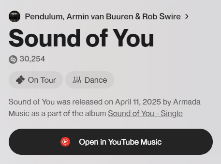

# Shazam - YouTube Music Button

A userscript that replaces the Apple Music button with a YouTube Music button on [Shazam](https://www.shazam.com/) song pages. Clicking the button searches for the song on YouTube Music.

## Installation

1. Install a userscript manager such as [Tampermonkey](https://www.tampermonkey.net/) or [Violentmonkey](https://violentmonkey.github.io/).
2. [Click here to install the script](https://raw.githubusercontent.com/SuperMartas/shazam-yt/main/shazam-yt.user.js).

## License

[MIT](LICENSE)
